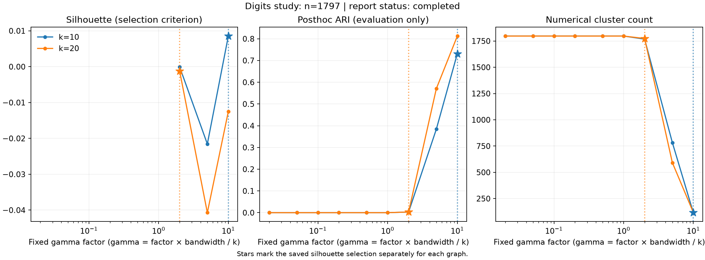
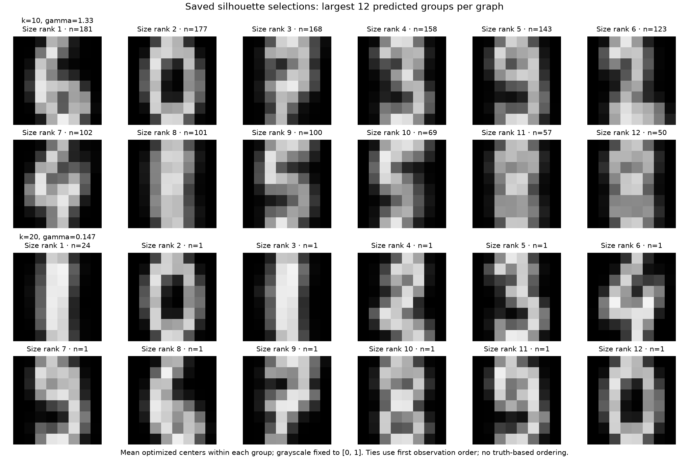

# Optical Digits: converged fits, fragile model selection

All 18 SSNAL path points and six cold ADMM cross-checks converged on 1,797
images with 64 features. The fixed silhouette rule nevertheless selected an
almost singleton partition for one of the two graphs. This study supports
numerical consistency on a real dataset and exposes a scientific usability
problem; it does not establish a reliable default model-selection method.

## Fixed choices and observed selections

The [protocol](digits_protocol.md) was committed at `9f522e9` before full-data
fitting; the fitting implementation was committed at `29853ed`. Both graphs
use all original pixel features divided by 16, symmetric union kNN edges,
and a bandwidth equal to the median positive retained-edge distance. Nine
fixed gamma factors are multiplied by bandwidth/k. Digit labels enter only
posthoc evaluation, after each graph's silhouette selection is fixed.

| Graph k | Edges | Selected factor | Selected gamma | Groups | Silhouette | Posthoc ARI |
| --- | ---: | ---: | ---: | ---: | ---: | ---: |
| 10 | 12,339 | 10 | 1.33023729 | 116 | 0.008540 | 0.731330 |
| 20 | 24,146 | 2 | 0.14697470 | 1,774 | −0.001182 | 0.003091 |

Both graphs are connected. The first six points on each path contain 1,797
singleton groups and have undefined silhouette scores. The remaining three
points are eligible under the frozen rule, which allows singleton groups
within a partition. Every point passed the numerical convergence gate.



Stars mark the saved selection separately for each graph. The 20-neighbor
selection has one group of 24 images and 1,773 singleton groups. Its final
path point has 118 groups and posthoc ARI 0.812455, but was **not selected**.
Replacing the saved choice with that point using its ARI would use the truth
labels for tuning. We retain the original choice and both graphs. For k=10,
the selected factor is the upper grid boundary, so the study also cannot
establish that this grid brackets a silhouette optimum.

ARI is adjusted Rand agreement with the digit labels, not predictive accuracy.
The study fits all observations jointly and makes no out-of-sample prediction.
The small or negative silhouettes describe separation in the original scaled
pixel space; recognizability of a few fitted images does not resolve this
selection problem. Future selection methods need a separately frozen protocol
and additional datasets, rather than tuning to this revealed outcome.

## Fitted images



Each tile averages the optimized centroids within one predicted group. Only
the largest 12 groups per graph are shown, ordered by size and first occurrence;
no truth labels determine their order. The k=10 fit has 116 groups, not ten
inferred classes. Most k=20 tiles represent individual observations.

## Numerical evidence and cost

SSNAL uses warm starts across nine points; ADMM starts cold at original grid
indices 0, 4 and 8. All 24 returned fits meet both the relative-gap and KKT
criteria at tolerance 1e-6. At all six cross-checks, SSNAL and ADMM have the
same partition at cluster tolerance 1e-4, and their centroid distances fit
within the sums of their reported centroid-error bounds.

At the final k=10 point the SSNAL global Frobenius bound is 0.020631 and the
ADMM bound is 0.021183; their actual distance is 0.0001005. Thus a stopping
tolerance of 1e-6 does not imply an absolute centroid error of 1e-6. The
[artifact audit](digits_audit.json) reconstructs graphs, checks saved primal
objectives and partitions, and compares recorded certificate intervals.
Five cross-check intervals overlap exactly; the lowest-gamma k=10 pair
misses overlap by about 1.1e-14, within the explicitly recorded floating-point
allowance. The audit retains this distinction.
The NPZ files retain centroids and partitions but not edge dual arrays, so
that audit cannot independently reconstruct dual feasibility. ADMM and SSNAL
also share library components; these are consistency checks, complementing
the separate [external implementation study](external_reference.md) and
small independent CVXPY tests.

| k | Nine SSNAL solves (s) | Three cold ADMM solves (s) | Full process (s) | Observed peak RSS (MiB) |
| --- | ---: | ---: | ---: | ---: |
| 10 | 38.10 | 75.58 | 119.19 | 371.48 |
| 20 | 53.56 | 88.06 | 147.19 | 623.48 |

These are single sequential fresh-process measurements on macOS 26.5.1 arm64,
NumPy 2.5.2, SciPy 1.18.1 and scikit-learn 1.9.0. Six numerical thread
variables were requested at one. Each graph had a 900-second deadline.
SSNAL solve totals exclude once-per-graph preparation; cold ADMM timings
include preparation and factorization for each point. Full process time
includes imports, graph construction, diagnostics, selection and checkpoint
writes. RSS is observed through the final full checkpoint. The study stores
an exact pairwise distance matrix and all fitted centroids: it is neither a
streaming-memory benchmark nor a repeated timing comparison.

## Reproduce and inspect

The original UCI `optdigits.tes` cohort and metadata are included offline with
[attribution, license and hashes](path:../examples/data/README.md). The original
classification test-cohort name describes its source, not a held-out test
in this transductive study. The source is Alpaydin and Kaynak's
[Optical Recognition of Handwritten Digits dataset](https://archive.ics.uci.edu/dataset/80/optical+recognition+of+handwritten+digits),
DOI 10.24432/C50P49. This is a new study inspired by the survey, not a replication
of a particular published experiment.

From a checkout with the package and plotting extra installed:

```bash
python -m pip install -e '.[examples]'
python examples/run_digits_study.py --output-dir build/digits-rerun
python examples/plot_digits_study.py build/digits-rerun/digits_k10.json build/digits-rerun/digits_k20.json --output-dir build/digits-rerun/figures
```

Use a fresh output directory. The driver checkpoints each completed point;
a terminated process can leave partial evidence, whose status and selection
gate must be inspected. A fast offline workflow check uses `--smoke` with
`examples/digits_study.py`, fitting the first 80 rows at indices 0, 4 and 8.
An unavailable smoke selection is an expected outcome when no eligible
partition exists; it is not a full-data result.

To recheck the committed full-data artifacts without fitting, run
`python examples/audit_digits_study.py`; the recorded audit passes 254 checks.
The local suite passes 698 tests, including 15 study-contract tests; those 15
also pass in the minimum-dependency environment.

The preserved evidence includes [k=10 records](digits_k10.json),
[k=10 arrays](digits_k10.npz), [k=20 records](digits_k20.json),
[k=20 arrays](digits_k20.npz), [process records and file hashes](digits_processes.json),
[the original launcher and logs](digits_execution.md), and
[the postrun artifact audit](digits_audit.json). Arrays include explicitly
named posthoc truth; the fitting and selection functions do not receive it.
