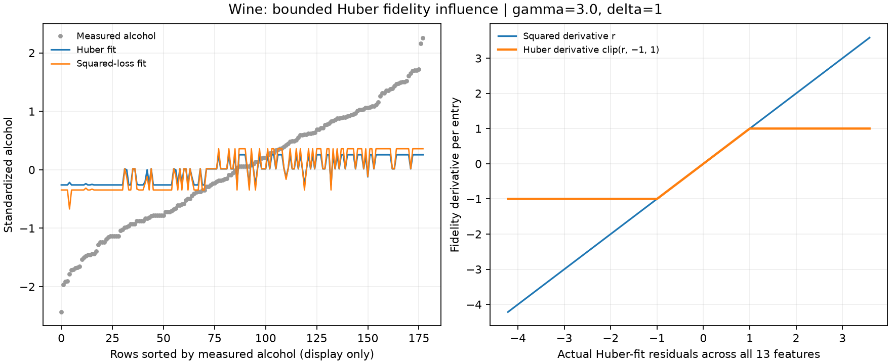
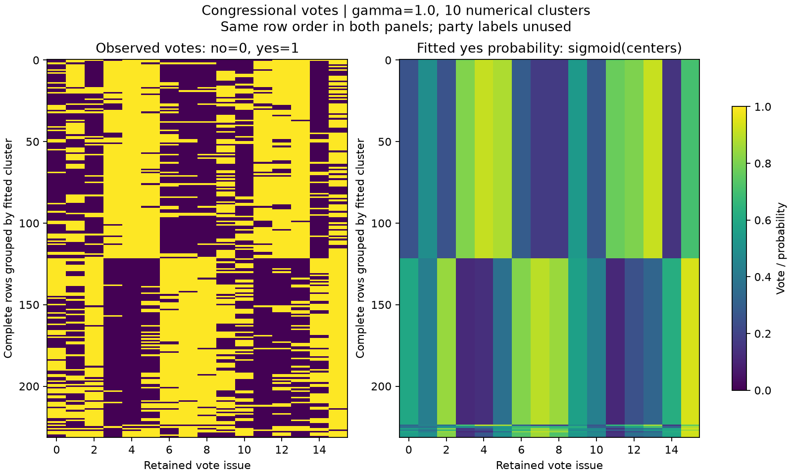
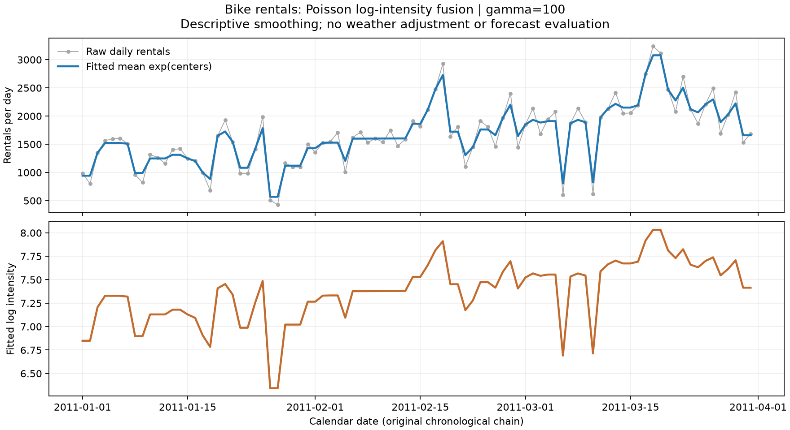

# Real-data generalized losses

Different observation types require different fidelity losses. These examples
use the same graph-fusion idea with continuous measurements, binary votes,
and integer counts. They are descriptive illustrations with fixed display
parameters, not predictive validation or parameter-selection experiments.
The [data attribution](path:../examples/data/README.md) records the original
UCI files and licenses. No class labels enter these fits.

Run the complete gallery after installing the examples extra:

```bash
python examples/gallery_generalized.py --output-dir artifacts/generalized
```

The script writes three figures, `diagnostics.json`, and `fits.npz` containing
selected row IDs, fitting inputs, graph CSR arrays, centers, duals, and fitted
means. Source and input-file hashes accompany the numerical certificates.
`--smoke` uses smaller fixed prefixes and is only a plumbing check. Each
generalized fit requests `tol=1e-6`; Huber and logistic allow 20,000 iterations,
and raw-count Poisson allows 100,000. A failed certificate stops
the gallery after preserving its diagnostics. The chosen strengths are
illustrative and may change the apparent clustering substantially.

## Huber: how much can one large residual influence a fitted value?

Wine's 178 rows contain 13 chemical measurements. All selected measurements
are standardized using their population mean and standard deviation; cultivar
labels are excluded. A symmetric union 10-neighbor Gaussian graph uses the
median positive retained-edge distance as bandwidth. Both fits use this same
graph and `gamma=3`: one has squared fidelity, and the other has entrywise
Huber fidelity with `huber_delta=1`.

For residual $r$, the Huber loss is $r^2/2$ when $|r|\leq1$, and
$|r|-1/2$ otherwise. Its derivative is clipped to $[-1,1]$. This bounds each
entry's fidelity derivative; it does not make the graph construction immune
to unusual observations. No artificial outliers were injected and no claim
of recovering the cultivar partition is made.

```python
import numpy as np
from examples.heldout_preprocessing import prepare_training
from ssnalclust import solve, solve_generalized

raw = np.loadtxt("examples/data/wine.data", delimiter=",", usecols=range(1, 14))
prepared = prepare_training(raw, np.ones(raw.shape, dtype=bool), neighbors=10)
X_standardized, weights = prepared.training_values, prepared.graph
robust = solve_generalized(X_standardized, weights, loss="huber",
                          huber_delta=1, gamma=3, tol=1e-6, max_iter=20000)
squared = solve(X_standardized, weights, gamma=3, tol=1e-6, max_iter=300)
assert robust.converged and squared.converged
```



The first panel shows the alcohol feature, sorted by its measured value only
for display. The second evaluates both derivatives at the actual Huber-fit
residuals across all features. Huber centers and fitted means are the same
continuous-valued quantity. Their optimization certificate is not a bound on
outlier-detection accuracy.

## Logistic: what is fused for binary voting patterns?

The Congressional Voting Records example discards rows containing a
non-yea/nay (`?`) entry and retains 232 complete rows from 435 in original
file order. In the source data, `?` aggregates other outcomes, including
present, abstention and no vote; those outcomes are excluded from this binary
illustration. It encodes `y=1` and
`n=0`, without using party affiliation. An issue constant in the retained rows
is explicitly excluded and recorded (none in the full 232-row example): otherwise the corresponding logistic
parameter has no finite optimum. The graph combines a union 10-neighbor graph
with spanning-tree connections, using Gaussian bandwidth 2. The illustrative
fusion strength is `gamma=1`.

The entrywise fidelity is $\log(1+\exp(u))-xu$. Fusion acts on the natural
parameters $u$, whereas fitted yes probabilities are $\operatorname{sigmoid}(u)$.
The connected graph and both observed outcomes for each retained issue ensure
that componentwise constant outcomes do not cause an unattained optimum.

```python
from pathlib import Path
from examples.gallery_generalized import load_votes
from ssnalclust import connected_k_neighbors_graph, solve_generalized

binary_votes, row_ids, retained_issues = load_votes(
    Path("examples/data/house-votes-84.data")
)
weights = connected_k_neighbors_graph(binary_votes, n_neighbors=10, bandwidth=2)
result = solve_generalized(binary_votes, weights, loss="logistic",
                           gamma=1, tol=1e-6, max_iter=20000)
probabilities = result.fitted_means  # sigmoid(result.centers)
assert result.converged
```



Both heatmaps use the same rows, grouped by the numerical fitted partition
at centroid-distance threshold `1e-4`. Colors share a fixed probability scale.
These probabilities smooth observed patterns on a graph built from those same
votes. They are not calibrated out-of-sample predictions or evidence of party
recovery; complete-case exclusion also changes the population represented.

## Poisson: how do nearby days share a rental intensity?

The Bike Sharing example takes the first 90 daily records, beginning
2011-01-01, and uses the original integer `cnt` totals without normalization
or clipping. Unit edges join consecutive days in chronological order. This
graph is determined by time, rather than by observed rental counts.

With `gamma=100`, the objective is

$$\sum_i [\exp(u_i)-x_i u_i] + 100\sum_i |u_{i+1}-u_i|.$$

The omitted log-factorial terms depend only on the data. Centers are log
intensities; expected rentals are $\exp(u_i)$ in the original daily-count units.
Fusing natural parameters does not fuse the raw observations or penalize
differences in fitted means directly.

```python
from pathlib import Path
from examples.gallery_generalized import load_bikes, chain_graph
from ssnalclust import solve_generalized

counts, dates, row_ids = load_bikes(Path("examples/data/bike_day.csv"), limit=90)
chronological_weights = chain_graph(len(counts))
result = solve_generalized(counts, chronological_weights, loss="poisson",
                           gamma=100, tol=1e-6, max_iter=100000)
expected_daily_rentals = result.fitted_means  # exp(result.centers)
assert result.converged
```



This is descriptive temporal smoothing. Weather, weekdays, exposure changes,
and overdispersion are not modeled. Neither the graph nor the likelihood
turns the fit into a forecast evaluation. A small objective gap and KKT
residual certify the stated optimization problem, not the adequacy of a
Poisson model for rental demand.

The raw-count example required a larger iteration budget: at 20,000 iterations,
the 90-day fit's relative gap was already below `1e-6`, but its KKT residual
was about `4.27e-6`. The gallery raises the iteration cap rather than rescaling
the observations or weakening the tolerance. This is an implementation-cost
limitation of the current generalized solver on this example.
