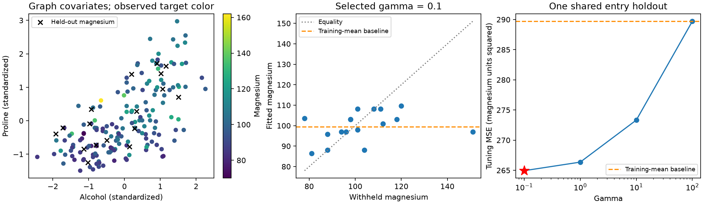

# Missing entries: Wine magnesium from a chemical-covariate graph

This example hides 17 of 178 measured magnesium values in the real
[UCI Wine data](https://archive.ics.uci.edu/dataset/109/wine) and fits the
missing-entry convex model. Missingness is simulated; this is not a dataset
with native missing measurements. Alcohol and proline remain fully observed
and define the graph. Cultivar labels are never loaded or used.



The left panel shows the graph's standardized covariates. Only training
magnesium values determine its colors; crosses identify withheld targets.
The middle panel compares withheld measurements with predictions from the
selected **training-mask fit**, not the full-data refit. The right panel shows
all four candidate tuning scores; the star marks the first minimum.

## Model and graph

The target is one column of magnesium in the original data units, without
standardization. The objective is

```text
0.5 sum_observed (U_i - magnesium_i)^2
    + gamma sum_edges w_ij abs(U_i - U_j).
```

The example calls the public `select_gamma` interface, which fits this model
using `solve_missing` and PDHG. Scalar Euclidean fusion is absolute difference.
The covariates are the Wine feature columns alcohol (index 0) and proline
(index 12); magnesium is feature index 4, excluding the label column.

Each covariate is standardized by its population standard deviation using all
178 available covariate measurements. A symmetric union 10-neighbor graph uses
stable row-index distance ties and Gaussian weights
`exp(-distance² / (2 * bandwidth²))`. The bandwidth is the median positive
undirected retained-edge distance: 0.3227538982 in this run. There are 1,080
undirected edges and one component.

These covariates are external to the held-out target values: no magnesium
entry contributes to graph scaling, distances, bandwidth or weights. This
satisfies the fixed-graph selector's leakage constraint without asserting
statistical independence between chemical measurements. The graph is a modeling
choice, not an established chemical interaction network.

## Executed outcome

A single entry split with seed 41 and fraction 0.1 retains 161 training
measurements and holds out 17. Every candidate uses the same mask. The selected
gamma is refitted on all magnesium entries after scoring.

| Gamma | Held-out tuning MSE |
| ---: | ---: |
| **0.1, selected** | **264.945332** |
| 1 | 266.363855 |
| 10 | 273.327183 |
| 100 | 289.704066 |

The training-mean baseline is 99.422360 magnesium units, with MSE 289.704146.
MSE is in squared original magnesium units. The minimum occurs at the smallest
prespecified gamma; no extrapolation or post hoc grid extension is made.
All four candidate fits and the full-data refit converged at tolerance 1e-6
within the 20,000-iteration budget. Their model-specific relative gap and
original KKT residual both pass; the saved edge duals permit further auditing.

These are **tuning scores on the same entries used to choose gamma**, not an
unbiased test-performance estimate. With only one split, this example makes
no confidence-interval or general prediction-accuracy claim. Missing-coordinate
solutions can be nonunique: the score evaluates the solver's deterministic
initialization and observed-range-box convention. A small objective gap does
not certify a unique imputation or small prediction error. See
[missing-data certificates](missing_certificates.md).

## Reproduce and inspect

From the repository root:

```bash
python -m pip install -e '.[examples]'
python examples/gallery_missing.py --output-dir build/gallery-missing
```

Add `--smoke` for a separate first-24-row check with k=5 and gammas 1 and 10.
The script writes `gallery_missing.json`, `gallery_missing.npz` and
`gallery_missing.png`. JSON includes all scores, convergence diagnostics and
source/data hashes. NPZ includes raw targets, covariates, scaling, graph CSR
arrays, masks, all candidate centroids/edge duals and the full-data refit.
Errors are recorded and raised; failed candidates are not silently discarded.
The public selector raises on nonconvergence, so a failed invocation cannot
return its partially completed candidate fits through this interface.

A direct masked-model call, using the saved input and selected gamma, is:

```python
import json
import numpy as np
from scipy import sparse
from ssnalclust import solve_missing

folder = "build/gallery-missing/"
with open(folder + "gallery_missing.json") as stream:
    report = json.load(stream)
with np.load(folder + "gallery_missing.npz") as saved:
    X = saved["raw_target"]
    training = saved["training_mask"]
    W = sparse.csr_matrix(
        (saved["graph_data"], saved["graph_indices"], saved["graph_indptr"]),
        shape=(len(X), len(X)),
    )
fit = solve_missing(np.where(training, X, np.nan), W,
                    gamma=report["selected_gamma"], tol=1e-6, max_iter=20000)
assert fit.converged
print(fit.relative_gap, fit.kkt_residual)
```

The data are attributed to Aeberhard and Forina (1992), UCI Wine,
DOI [10.24432/C5PC7J](https://doi.org/10.24432/C5PC7J), distributed under
CC BY 4.0. Original files and attribution are retained in the
[offline data record](path:../examples/data/README.md). This demonstration uses
no cultivar labels and does not evaluate cultivar recovery. Return to the
[method gallery](gallery.md) or compare the more extensive
[Wine repeated entry-holdout study](wine_holdout.md).
