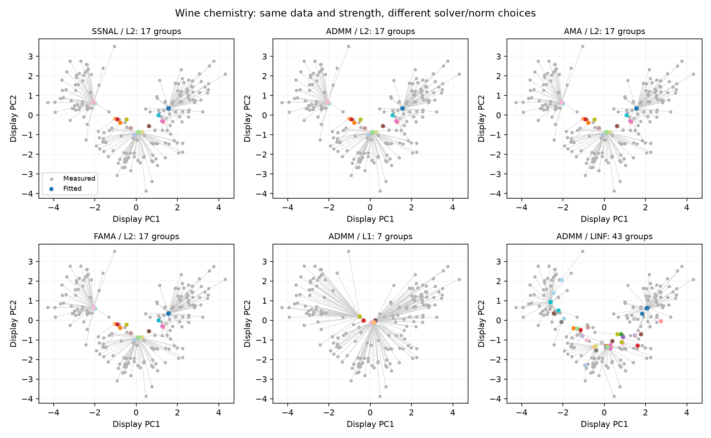
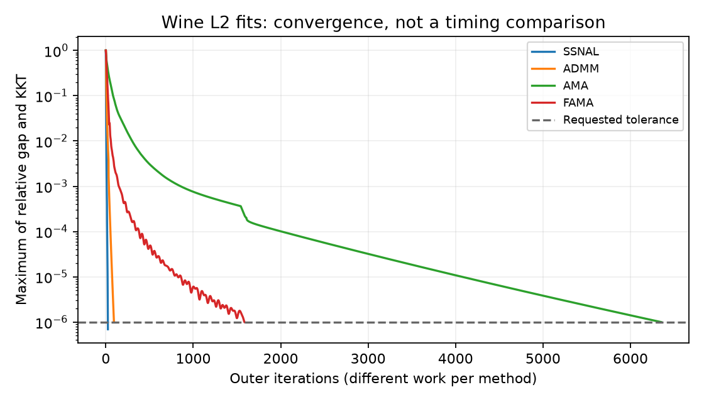
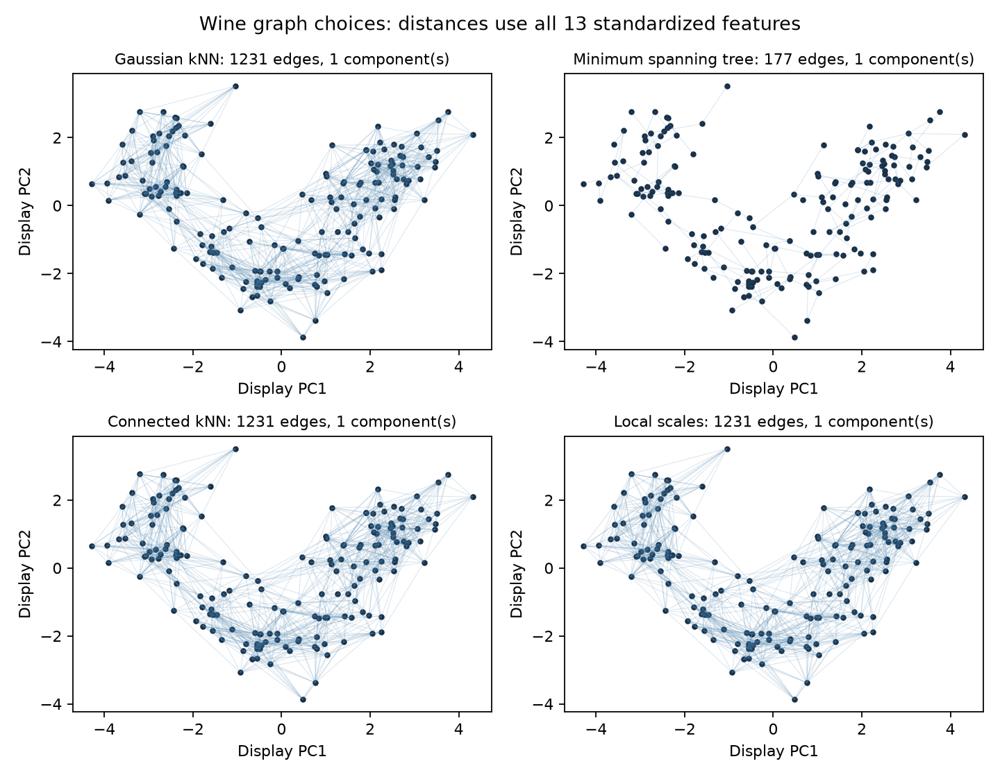
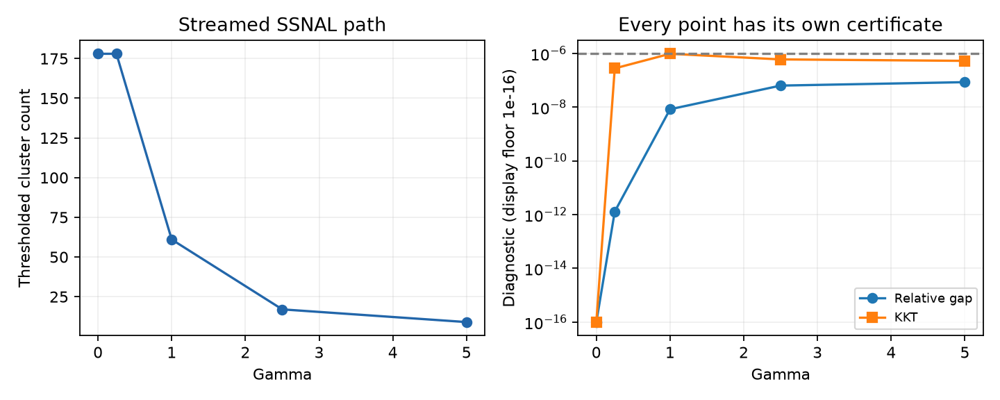

# Solvers, fusion norms, graphs and paths on Wine chemistry

The UCI Wine measurements provide a concrete clustering question: which samples
have chemical profiles that a graph-fusion model summarizes together? This
example uses all 178 samples and 13 measurements. It never loads the cultivar
class column. Its groups are descriptive summaries, not recovered cultivar
labels. See the [data attribution](path:../examples/data/README.md).

Run the complete calculation from the repository root:

```bash
python examples/gallery_solvers.py --output-dir artifacts/solvers
```

The command produces the four figures below, `solvers.json`, and `solvers.npz`.
The [gallery downloads](gallery.md#inspect-the-saved-full-runs) retain the
executed results. `--smoke` uses only the first 24 rows and five neighbors.

## Set up one measured-data problem

Features are centered and divided by their population standard deviations.
Distances and fits use all 13 standardized features. A symmetric union of
10-nearest-neighbor edges is weighted by
`exp(-0.5 * (distance / bandwidth)**2)`, with bandwidth equal to the median
positive retained-edge distance. The resulting graph has 1,231 undirected edges,
one connected component, and bandwidth approximately 2.44467.

This is a full-data descriptive fit. A predictive validation workflow must
instead learn preprocessing from training data, as the
[missing-data example](gallery_missing.md) explains.

```python
import numpy as np
from examples.heldout_preprocessing import prepare_training
from ssnalclust import ConvexClusteringProblem

raw = np.loadtxt("examples/data/wine.data", delimiter=",", usecols=range(1, 14))
prepared = prepare_training(raw, np.ones_like(raw, dtype=bool), neighbors=10)
X, W = prepared.training_values, prepared.graph
problem = ConvexClusteringProblem(X, W)
```

## Four solvers, one objective

With L2 fusion and unit fidelity weights, each solver minimizes

```{math}
\frac12\|U-X\|_F^2 + \gamma\sum_{(i,j)}w_{ij}\|U_{i,:}-U_{j,:}\|_2.
```

Here gamma is fixed at 2.5 to illustrate partial fusion. It was not chosen by
a scientific validation criterion. Use the setup above, then:

```python
fits = {}
for solver in ("ssnal", "admm", "ama", "fama"):
    fit = problem.solve(
        gamma=2.5, solver=solver, penalty="l2",
        tol=1e-6, max_iter=50000, check_every=1, store_history=True,
    )
    if not fit.converged:
        raise RuntimeError(f"{solver} did not converge")
    fits[solver] = fit
```

**SSNAL** uses an augmented-Lagrangian outer iteration with semismooth Newton
steps for its inner problem. **ADMM** alternates updates of centroids, edge
differences, and dual variables. **AMA** uses a simpler alternating scheme;
**FAMA** adds acceleration to AMA. They offer different numerical routes to
the same L2 solution. See the [algorithm audit](algorithm_audit.md) for the
implemented updates and [API](api.md) for solver controls.



Gray dots show measured samples; lines connect them to colored fitted
centroids. Every panel uses the same two principal components of the input
for display only. Colors are visual aids, can repeat, and are not cultivar
labels. Overlap in this projection does not prove equality in 13 dimensions.

The recorded L2 runs all gave 17 numerical groups at clustering tolerance
`1e-4`. More substantively, the script checks that each fitted centroid matrix
differs from the SSNAL fit by no more than the sum of their certified
Frobenius-error bounds. Equal group counts alone would not establish agreement.

| L2 solver | Recorded outer iterations | Relative gap | Normalized KKT residual |
| --- | ---: | ---: | ---: |
| SSNAL | 24 | 7.65e-8 | 6.93e-7 |
| ADMM | 93 | 5.90e-8 | 9.87e-7 |
| AMA | 6,351 | 1.04e-7 | 9.99e-7 |
| FAMA | 1,586 | 1.89e-7 | 1.00e-6 |

Values in the table are rounded; the saved unrounded values meet `1e-6`.



An outer iteration performs different work in each algorithm, particularly
SSNAL's inner Newton solves. This plot measures diagnostic progress, not
elapsed-time speed. It does not establish a universally fastest solver.
The [scalability](scalability.md) and [high-dimensional](high_dimensional.md)
studies provide measured timing evidence for their specified workloads.

## Change the fusion norm

The last two fitted panels use ADMM with the same data, graph, and gamma but
different edge penalties:

```python
l1_fit = problem.solve(gamma=2.5, solver="admm", penalty="l1", tol=1e-6)
linf_fit = problem.solve(gamma=2.5, solver="admm", penalty="linf", tol=1e-6)
for fit in (l1_fit, linf_fit):
    if not fit.converged:
        raise RuntimeError("Fusion-norm fit did not converge")
```

L1 sums absolute feature differences on each edge; L2 uses their Euclidean
length; L-infinity penalizes their largest absolute difference. Changing the
norm changes the objective and its effective penalty scale. At gamma 2.5,
the recorded L1 and L-infinity runs produced seven and 43 groups respectively.
Those counts do not rank their scientific quality, and their objective values
should not be compared as if they solved the same problem. ADMM, AMA and FAMA
support all three norms; SSNAL supports L2.

## Choose the graph

The graph defines which pairs receive direct fusion penalties. All four
constructions below use the same standardized Wine matrix:

```python
from ssnalclust import (
    k_neighbors_graph, minimum_spanning_tree_graph,
    connected_k_neighbors_graph, self_tuning_graph,
)

knn = k_neighbors_graph(X, n_neighbors=10, bandwidth=prepared.bandwidth)
tree = minimum_spanning_tree_graph(X, bandwidth=prepared.bandwidth)
connected = connected_k_neighbors_graph(X, n_neighbors=10, bandwidth=prepared.bandwidth)
local = self_tuning_graph(X, n_neighbors=10, scale_neighbors=10)
```



The tree retains 177 edges. Connected kNN unions the kNN graph with the full
Euclidean minimum spanning tree. In this Wine example, those tree edges already
belong to the kNN graph, so its topology is unchanged. Connectivity alone does
not guarantee that adding the tree leaves an arbitrary kNN graph unchanged. Local scales
use neighbor distances around each endpoint to set edge weights. Here their
topology matches kNN, so the unweighted edge drawing looks the same even though
weights differ. The NPZ retains those weights. No graph is declared best from
this display, and the tree builder's construction can require quadratic work
despite its sparse output.

## Follow a regularization path

A prepared problem reuses graph structure across fits. A streamed path lets
the caller consume one result at a time; summary streaming avoids retaining
every centroid matrix. This example uses gamma values `[0, 0.25, 1, 2.5, 5]`:

```python
from ssnalclust import iter_path_summaries

source = problem.iter_path(
    [0, 0.25, 1, 2.5, 5], solver="ssnal",
    tol=1e-6, max_iter=300, store_history=False,
)
summaries = iter_path_summaries(source)
try:
    for point in summaries:
        if not point["converged"]:
            raise RuntimeError("Path point did not converge")
        print(point["n_clusters"], point["relative_gap"], point["kkt_residual"])
        del point
finally:
    summaries.close()
    source.close()
```



The count falls from 178 to nine in this executed path. Each gamma is a
separate optimization problem with its own stopping checks. The connected
line is a visual guide between sampled values; it does not establish a
strictly nested hierarchy at unsampled values. Gamma zero leaves the
measurements unchanged. See [streaming memory](streaming_memory.md) for measured
memory behavior and the [user guide](user_guide.md) for path selection.
