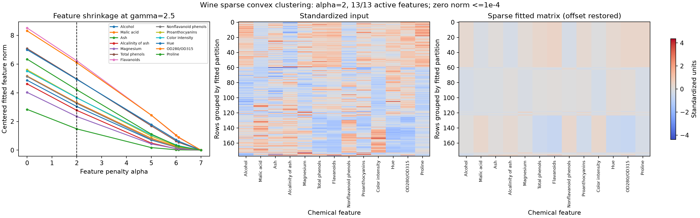
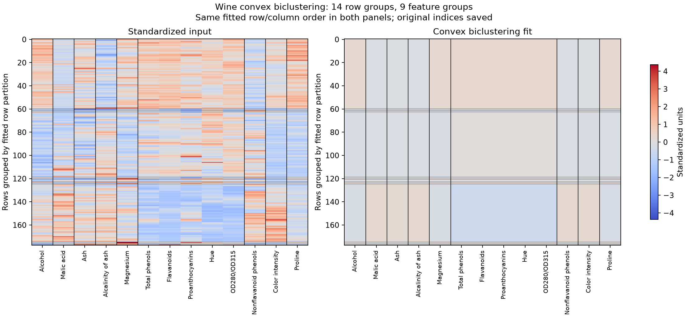

# Sparse clustering and biclustering of Wine chemistry

These examples ask two different questions about a measurement matrix. Can a
row-clustering model suppress variation in whole chemical features? Can a joint
row-and-column model produce a simpler matrix with repeated sample profiles and
repeated feature profiles? Neither question requires the cultivar classes. The
example never loads the first, cultivar-label column of the bundled UCI Wine
file; it uses all 178 rows and 13 chemical measurements in their original order.
See the [data source and attribution](path:../examples/data/README.md).

The settings below were chosen to illustrate the penalties, not selected by a
validation criterion. The resulting groups are numerical summaries of these
measurements, not evidence that the cultivar classes have been recovered.

## Run and inspect the saved calculation

From the repository root, with the `examples` extra installed:

```bash
python examples/gallery_structured.py --output-dir artifacts/structured
```

The command writes two figures, `gallery_structured.json`, and
`gallery_structured.npz`. It raises an error if any fit fails its stopping test.
The JSON records every fitted penalty value, convergence, primal and dual
objectives, absolute and relative gaps, KKT residuals, iterations, timings,
data/source hashes, and dependency versions. The NPZ contains original and
standardized data, scaling, fitted matrices in both coordinate systems, duals,
CSR graph arrays, labels, and original row/column index mappings. Load it with
`numpy.load(..., allow_pickle=False)`.

`--smoke` instead uses the first 24 rows and the shorter sparse path
`[0, 2, 5]`. This checks execution; its figures and numerical outcomes are not
the full-data example reported here.

## Make distances comparable before fitting

Each feature is centered by its mean and divided by its population standard
deviation across the available Wine rows. A constant feature uses scale one.
This is a full-data descriptive calculation, not a training/validation split.
A unit difference in alcohol concentration and a unit difference in magnesium
therefore enter the objective as differences in standardized units, not their
original chemical units.

The row graph is a symmetric union of each observation's 10 nearest neighbors.
Its Gaussian weights are `exp(-0.5 * (distance / bandwidth)**2)`, where bandwidth
is the median positive distance of retained undirected edges. Stable row order
breaks distance ties. On the full data, this gives 1,231 edges and bandwidth
approximately 2.44467.

The biclustering column graph applies the same construction to the feature
profiles `X.T`, with four neighbors. It does **not** standardize that transpose
again: each feature profile already consists of standardized Wine measurements.
Its 32 edges have bandwidth approximately 15.25549. The row and column penalties
act on vectors of different lengths, so their numerical strengths are not
interchangeable.

The following setup supplies the variables used in both API snippets (run from
the repository root):

```python
import numpy as np
from examples.heldout_preprocessing import prepare_training
from examples.gallery_structured import column_graph as make_column_graph

raw = np.loadtxt("examples/data/wine.data", delimiter=",", usecols=range(1, 14))
prepared = prepare_training(raw, np.ones_like(raw, dtype=bool), neighbors=10)
X, row_graph = prepared.training_values, prepared.graph
feature_means, feature_scales = prepared.means, prepared.scales
column_graph, column_bandwidth, _ = make_column_graph(X)
```

## Sparse convex clustering: suppress whole feature profiles

For standardized data `X`, sparse clustering first removes its column means
`offset` and calls the centered matrix `C`. It fits

```{math}
\frac12\|U-C\|_F^2
+ \gamma\sum_{(i,j)}w_{ij}\|U_{i,:}-U_{j,:}\|_2
+ \alpha\sum_{q=1}^{13}\|U_{:,q}\|_2.
```

Here `gamma = 2.5`, and all feature weights are one. The feature penalty acts
on an entire centered column. A column with fitted norm at most `1e-4` is
reported as numerically zero; this is a disclosed numerical convention, not a
claim of an exact zero proved in floating-point arithmetic.

The full illustrative alpha path is `[0, 2, 5, 6, 6.1, 7]`; every point is
retained in the output. The displayed fitted heatmap uses alpha 2, where row
fusion is visible while variation remains in all 13 chemical features. The
same fitted row order and color limits are applied to input and fit.



In the executed full-data run, alpha 2 produced 17 numerical row groups. All
13 feature norms remained above the zero threshold through alpha 6.1; at alpha
7 every feature norm fell below it. Thus these settings demonstrate
feature shrinkage and eventual suppression, but do not identify a selectively
retained subset of chemicals. The feature-norm path makes that limitation
visible instead of implying successful feature selection.

During illustration development, alpha 10 and 15 also suppressed every feature.
An exploratory alpha 6.3 fit did not meet the requested tolerance within 30,000
iterations. These settings are not part of the final runnable path; the failed
fit is not presented as a converged result. No further search for a preferred
feature subset was performed.

For an existing standardized matrix `X` and fixed `row_graph`, the core call is:

```python
from ssnalclust import solve_sparse

sparse_fit = solve_sparse(
    X, weights=row_graph, gamma=2.5, alpha=2,
    tol=1e-6, max_iter=20000,
)
if not sparse_fit.converged:
    raise RuntimeError("Sparse fit did not converge")
fitted_standardized = sparse_fit.centers + sparse_fit.offset
fitted_original_units = fitted_standardized * feature_scales + feature_means
```

Adding `offset` is necessary before undoing external standardization. The sparse
result's `feature_norms` describe `centers`, not the offset-restored matrix. A
removed feature returns to its mean in original units; it does not become a
zero chemical concentration.

## Convex biclustering: fuse both axes

The biclustering objective is

```{math}
\frac12\|U-X\|_F^2
+ \gamma_r\sum_{(i,j)}w^r_{ij}\|U_{i,:}-U_{j,:}\|_2
+ \gamma_c\sum_{(q,s)}w^c_{qs}\|U_{:,q}-U_{:,s}\|_2.
```

The fixed choices are `gamma_row = 2.5` and
`gamma_col = column_bandwidth / 4`, approximately 3.81387. Biclustering does
not internally center the input. Its fitted matrix is already in the supplied
standardized coordinates.

```python
from ssnalclust import solve_biclustering

bicluster_fit = solve_biclustering(
    X, row_weights=row_graph, column_weights=column_graph,
    gamma_row=2.5, gamma_col=column_bandwidth / 4,
    tol=1e-6, max_iter=20000,
)
if not bicluster_fit.converged:
    raise RuntimeError("Biclustering fit did not converge")
fitted_original_units = bicluster_fit.centers * feature_scales + feature_means
```



The executed fit gave 14 row groups and nine feature groups at Euclidean
clustering tolerance `1e-4`. Labels are transitive components of all fitted row
or column pairs within this tolerance. The two heatmaps use exactly the same
row and column permutations, determined from the fit; boundaries indicate its
groups. Sorting is stable within each group, and the NPZ preserves the mapping
back to original sample and feature indices. Equal standardized feature
profiles do not imply equal measurements in their original physical units.

All fits use PDHG with `tol=1e-6` and `max_iter=20000`; stopping requires both
relative primal-dual gap and normalized KKT residual to meet the tolerance.
The biclustering run converged after 19,168 iterations, with absolute gap about
`5.63e-4` and KKT residual about `1.00e-6`. These are optimization diagnostics,
not tests of the scientific usefulness of the groups. Fine thresholded group
counts may vary with numerical tolerance and platform. The gallery makes no
runtime comparison or general performance claim.
