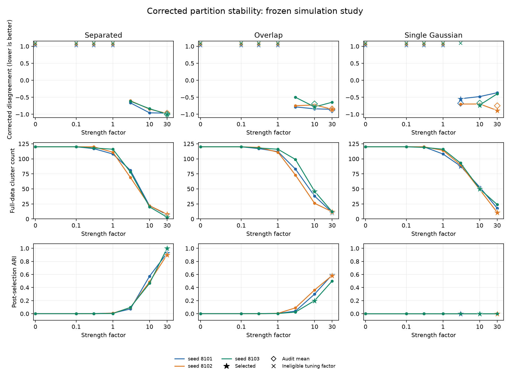

# Corrected partition stability: recovery and a Gaussian control

A frozen nine-dataset study completed all 783 prescribed fits, and an
independent saved-array audit passed 15,734 checks. The selector avoided the
undefined singleton endpoint, but still chose 88, 11 and 50 clusters on three
single-Gaussian samples. This is evidence about a selection criterion's limits,
not a reliable automatic answer to whether clusters exist.

The experiment remains in `examples/`; it does not add a public model-selection
API. The [protocol](stability_protocol.md) was frozen at `307a4fb`, with the
nontrivial-partition conditioning clarified at `9e68803`, before the smoke
run. Implementation `3469a4b` was committed before all full runs. No factors,
seeds, support thresholds or convergence requirements changed after fitting.

## Recorded choices

Each dataset has 120 observations and two features. Five pairs of 80% row
subsamples determine the choice; five new pairs assess that chosen factor
without reselection. Every subsample rebuilds its scaling and union k=10
graph. Factors multiply its own median edge-distance bandwidth divided by 10.
They are not fixed cluster counts, or identical absolute strengths across fits.

Lower corrected disagreement is better; -1 means identical nondegenerate
co-membership on the shared observations. Audit scores reuse the same dataset
with fresh sampling seeds. They are conditional resampling diagnostics, not
independent population validation.

| Scenario | Seed | Factor | Tuning score | Audit score | Full clusters | Singleton fraction | Post-selection ARI |
| --- | ---: | ---: | ---: | ---: | ---: | ---: | ---: |
| Separated | 8101 | 30 | -0.9661 | -0.9680 | 7 | 0.0250 | 0.9270 |
| Separated | 8102 | 30 | -0.9770 | -0.9666 | 8 | 0.0250 | 0.9017 |
| Separated | 8103 | 30 | -0.9968 | -1.0000 | 3 | 0.0000 | 1.0000 |
| Overlap | 8101 | 30 | -0.8541 | -0.8708 | 11 | 0.0417 | 0.5944 |
| Overlap | 8102 | 30 | -0.8527 | -0.8387 | 12 | 0.0500 | 0.5841 |
| Overlap | 8103 | 10 | -0.7845 | -0.6930 | 46 | 0.2583 | 0.1999 |
| Single Gaussian | 8101 | 3 | -0.5425 | -0.6797 | 88 | 0.5833 | 0.0000 |
| Single Gaussian | 8102 | 30 | -0.8872 | -0.7495 | 11 | 0.0417 | 0.0000 |
| Single Gaussian | 8103 | 10 | -0.7287 | -0.6691 | 50 | 0.2667 | 0.0000 |

Singleton fraction is the fraction of observations in singleton clusters.
All nine selected factors remained eligible on all audit comparisons. None of
these runs produced the permitted no-selection outcome; separate tests verify
that outcome rather than silently forcing a choice.



Stars mark the frozen selections. Open diamonds show the new audit mean at the
selected factor. Crosses above the score range flag ineligible tuning factors;
their vertical positions are display offsets, not numerical scores. The x-axis
is logarithmic above 0.1 and linear near zero. Lines connect only evaluated
factors and do not identify exact fusion events.

## What the experiment shows

The three separated-group graphs each have three connected components. Their
selected full fits have 7, 8 and 3 thresholded clusters. The strongest prescribed
factor wins in all three cases; the grid was not extended to obtain a preferred
count. Disconnection already constrains the optimization problem, so this is
not evidence of equivalent recovery on arbitrary connected graphs.

The overlapping mixtures and Gaussian controls have connected full-data
graphs. Overlap recovery varies substantially: one selected fit has 46 clusters
and ARI about 0.20. A repeatable partition can preserve sample geometry without
recovering the generating mixture labels.

On the Gaussian control, the support rule excludes all-fused comparisons as
well as all-singleton comparisons. The selector therefore conditions on
nontrivial partitions; it cannot test the existence of multiple populations.
The reported multi-group choices and zero ARIs demonstrate that limitation.
ARI against a single generating label is mechanically zero for any nontrivial
partition, and one for an all-fused partition. It is not a significance test.

## Score and selection checks

For T unordered shared-observation pairs, let A and B be the numbers
co-clustered in each partition and C the number co-clustered in both. The
implemented corrected score is

$$
-\frac{TC-AB}{\sqrt{A(T-A)B(T-B)}}.
$$

The implementation uses observed contingency cells and Python integer products,
avoiding both a dense cluster-by-cluster table and quadratic pair storage.
Raw disagreement is (A+B-2C)/T. If an indicator is constant, the corrected score
is undefined; it is recorded as null. A factor needs at least ten co-clustered
and ten separated pairs in **each** partition on **every** tuning overlap.
The minimum is a declared study convention, not a calibrated statistical test.

All factors through 1 were ineligible in every dataset; factor 3 was also
ineligible for Gaussian seed 8103. Only eligible factors enter ranking, and an
ineligible comparison never disappears from an average. The selected factor
is written to a separate artifact before any audit fit. Ground-truth labels
enter only the final ARI calculation after fitting.

Tests compare the score with explicit pair indicators and Pearson correlation
for all 2,704 pairs of five-observation partitions. Additional tests cover
large integer counts, renaming and permutation invariance, endpoint degeneracy,
minimum support, exact ties, invalid scores, and no selection. Workflow tests
change truth without changing the decision and enforce the decision artifact's
existence before audit fitting.

## Numerical and execution evidence

The [independent audit](stability_results/audit.json) reconstructs generated
features, sample identities, standardization, graph edges and weights, overlap
scores, selection, thresholded partitions and ARI. It recomputes squared-loss
primal/dual objectives, original KKT residuals, dual-ball feasibility and
center-error bounds from saved centers and edge duals. It uses explicit pair
indicators rather than the study's contingency comparator, and separate graph
and certificate code rather than production solver diagnostics.

Across all 783 fits, maximum independently recomputed KKT residual was
9.9879e-7, maximum relative gap 9.6773e-7, and maximum dual-ball excess
1.33e-15, within the audit's stated floating-point allowance. All scheduled
fits converged. The audit is a floating-point reconstruction, not interval
certification. Tests reject corrupted centers, comparisons and decisions even
when hashes are refreshed, and reject unfinished manifests.

Selected full-data center-error bounds range from 0.00070 to 0.01395. These
bounds exceed the 1e-4 cluster-label threshold and do not certify exact
partitions. Tighter-tolerance partition sensitivity remains an open question.
Numerical convergence and statistical usefulness are separate requirements.

Each of nine fresh sequential workers used a 600-second deadline and six
numerical thread variables set to one. All completed in 8.73–11.54 seconds,
with observed native peak RSS 141.34–149.64 MiB. These times include preparation,
fitting and repeated compressed checkpoint writes; they are not isolated
solver benchmarks. Measurements used macOS 26.5.1 arm64, Python 3.12.5, NumPy
2.5.2, SciPy 1.18.1 and scikit-learn 1.9.0. Saved solver and harness/helper
source hashes all matched the frozen implementation's files. The first Windows
CI run caught LF-to-CRLF conversion of the hashed protocol; its observed hash
matched that transformation exactly. Protocol checkout rules now preserve LF
bytes, and a simulated Windows checkout passed all eight provenance checks.

Only three datasets per simulation family were studied, with matching seeds
pairing random draws across scenarios. No confidence intervals assume
independent observation pairs or nine independent datasets. Other sample sizes,
dimensions, graph rules, support thresholds and cluster geometries remain open.

## Reproduce and inspect

```bash
python examples/stability_study.py --output-dir build/stability-rerun
python examples/audit_stability.py build/stability-rerun --output build/stability-rerun/audit.json
python examples/plot_stability.py build/stability-rerun --output build/stability-rerun.png
```

Use a fresh directory. Add `--smoke` to the first command for the separately
specified plumbing check; those smaller runs are not full measurement evidence.
CI runs the smoke workflow, audit and plot on Linux, Windows and macOS.

The [manifest](stability_results/study.json) records process outcomes and hashes.
Each worker directory contains `report.json`, `report.npz`, `selection.json`
and `worker.txt`. NPZ files preserve features, generating labels, sampling IDs,
preprocessing statistics, graph CSR arrays, centers, edge duals and labels.
JSON refers to their exact array keys. Checkpoints replace arrays before JSON,
so interrupted arrays may contain a newer prefix than the last JSON record.
The source archive preserves the directory layout required by the manifest;
browser downloads can rename files and should be restored to these paths.

| Scenario | Seed 8101 | Seed 8102 | Seed 8103 |
| --- | --- | --- | --- |
| Separated | [JSON](stability_results/separated_8101/report.json) · [NPZ](stability_results/separated_8101/report.npz) · [Choice](stability_results/separated_8101/selection.json) | [JSON](stability_results/separated_8102/report.json) · [NPZ](stability_results/separated_8102/report.npz) · [Choice](stability_results/separated_8102/selection.json) | [JSON](stability_results/separated_8103/report.json) · [NPZ](stability_results/separated_8103/report.npz) · [Choice](stability_results/separated_8103/selection.json) |
| Overlap | [JSON](stability_results/overlap_8101/report.json) · [NPZ](stability_results/overlap_8101/report.npz) · [Choice](stability_results/overlap_8101/selection.json) | [JSON](stability_results/overlap_8102/report.json) · [NPZ](stability_results/overlap_8102/report.npz) · [Choice](stability_results/overlap_8102/selection.json) | [JSON](stability_results/overlap_8103/report.json) · [NPZ](stability_results/overlap_8103/report.npz) · [Choice](stability_results/overlap_8103/selection.json) |
| Single Gaussian | [JSON](stability_results/single_gaussian_8101/report.json) · [NPZ](stability_results/single_gaussian_8101/report.npz) · [Choice](stability_results/single_gaussian_8101/selection.json) | [JSON](stability_results/single_gaussian_8102/report.json) · [NPZ](stability_results/single_gaussian_8102/report.npz) · [Choice](stability_results/single_gaussian_8102/selection.json) | [JSON](stability_results/single_gaussian_8103/report.json) · [NPZ](stability_results/single_gaussian_8103/report.npz) · [Choice](stability_results/single_gaussian_8103/selection.json) |
