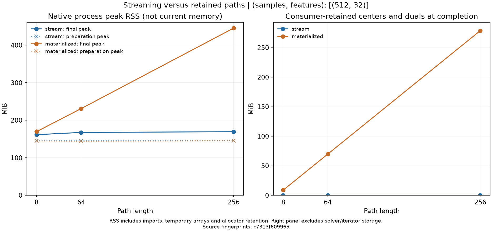

# Streaming paths: measured retention and lifetime fixes

On a fixed 512-sample, 32-feature problem, streaming peak RSS increased from
161.48 to 169.39 MiB as the path grew from 8 to 256 points. Retaining the full
list increased peak RSS from 169.66 to 445.50 MiB. Every corresponding centroid,
dual and recorded numerical diagnostic matched exactly between modes at each
path length; all 656 fits converged.

This is evidence for consuming long paths without retaining all returned
arrays. It is a single measurement per setting on one modest graph, with
limits described below, rather than a universal constant-memory guarantee.

## Results



| Points | Stream peak RSS (MiB) | List peak RSS (MiB) | Retained list arrays (MiB) | Stream process (s) | List process (s) |
| ---: | ---: | ---: | ---: | ---: | ---: |
| 8 | 161.48 | 169.66 | 8.71 | 1.76 | 1.74 |
| 64 | 167.48 | 230.95 | 69.69 | 5.12 | 5.63 |
| 256 | 169.39 | 445.50 | 278.75 | 14.91 | 15.42 |

The streaming consumer retains zero returned centroid/dual arrays at final
completion. During each solve, the problem and generator still need data,
graph storage, warm-start snapshots and solver workspace. Zero consumer-held
arrays does not mean zero process memory. Each returned point contains
1,141,760 bytes of centroid and dual arrays; the retained list's array storage
therefore grows exactly with length. Python object overhead is additional.

Native RSS is a process high-water mark, including imports, graph construction,
temporary arrays and allocator retention. Its preparation baseline was about
144–146 MiB. A high-water mark does not fall when an array is released, and
small differences between fresh processes are expected. The results show
markedly different path-length scaling in these runs; they do not prove that
streaming RSS is mathematically constant or measure an old-versus-new speedup.

The [frozen protocol](streaming_protocol.md) was committed at `ab82639`, and
the fixed implementation and harness at `af57d18`, before full measurements.
All six fresh workers completed within their original 120-second deadlines.
Each requested six numerical thread variables at one. Measurements used
macOS 26.5.1 arm64, Python 3.12.5, NumPy 2.5.2, SciPy 1.18.1 and scikit-learn
1.9.0. Full environment and source hashes remain in the worker records.

## Numerical comparability and problem scope

The seed-7301 Gaussian data use four balanced groups and a symmetric union
10-neighbor graph with 3,948 undirected edges. The graph has four connected
components and no isolates. Median retained-edge distance sets bandwidth
2.28246814, and median edge weight is 0.60653066. This is a disconnected graph
of well-separated groups; it does not establish the same numerical workspace
cost on arbitrary connected, dense or irregular graphs.

Each path spans gamma 0.005 to 0.5 with its own logarithmic grid. The independent
[audit](streaming_audit.json) compares all 328 corresponding points per mode,
including centroid/dual hashes, objectives, gaps, KKT residuals, error bounds,
movement, fusion and array-byte accounting. Exact agreement is checked **at
equal path length**: denser grids change warm starts, so floating-point endpoint
results need not be identical across lengths.

All fits meet both relative-gap and KKT tolerance 1e-6. At the final point,
centroid movement is about 18.43% of the centered input Frobenius norm, and
99.49% of graph edges have centroid differences at most 1e-4. This is material
shrinkage and fusion, rather than a negligible-penalty timing case. Final global
centroid-error bounds range from about 0.00368 to 0.00496. The study measures
memory and numerical parity, not cluster recovery or model selection.

Process time includes imports, preparation, solving, diagnostics and checkpoint
output. Streaming emits scalar point records between solves; materialized
`path()` returns its list before emitting those records. Only the separately
named materialized solve time excludes these diagnostics. The process timings
are descriptive and do not isolate a causal algorithmic speed difference.

## What was fixed and how to consume a path

The lifetime audit found two unnecessary retained references. Copying the
stream's keyword dictionary kept the original caller-supplied `x0` and `dual0`
alive after replacement; views could keep much larger backing arrays alive.
The generator also held its previous result while allocating the next solve.
It now replaces the initial references in its own keyword dictionary and drops
its previous result on resumption, before computing the next point.

Private centroid and dual snapshots still protect warm starts from caller
mutation. Four regression cases cover both the prepared and public streaming
interfaces: they verify collection of obsolete backing buffers, collection
before the next solve begins, and preserved ownership. All four fail against
the original implementation. These are bounded retention fixes; the original
stream did not accumulate every result internally.

```python
from ssnalclust import ConvexClusteringProblem

problem = ConvexClusteringProblem(X, weights=W)
stream = problem.iter_path(gammas, store_history=False)
try:
    while True:
        try:
            result = next(stream)
        except StopIteration:
            break
        # Save scalar diagnostics or write arrays to external storage here.
        print(result.objective, result.converged, result.center_error_bound)
        del result
finally:
    stream.close()
```

An ordinary `for result in stream` loop also works, but its loop variable can
hold the previous result until the next one is yielded. Explicit deletion
avoids that overlap when minimizing peak memory matters. Appending results to
a list restores full-path retention. `summarize_path` returns a list containing
labels at every point and therefore also retains data proportional to path
length. Turning off histories alone does not make either list-returning API
a streaming consumer. Close a partially consumed generator when done to
release its internal references.

## Reproduce and inspect

From a checkout with the package and plotting extra installed:

```bash
python -m pip install -e '.[examples]'
python examples/streaming_memory.py --output build/streaming-rerun.jsonl
python examples/plot_streaming_memory.py build/streaming-rerun.jsonl --output build/streaming-memory.png --audit build/streaming-audit.json
```

Use a fresh output path and its adjacent `.workers` directory. Add `--smoke`
to the first command for the separate 40-sample, 3-feature, length-3/5 harness
check. The smoke runs are not full measurement evidence. Linux and macOS
provide native peak RSS; Windows still runs the numerical and retained-array
checks, with native RSS explicitly unavailable.

The [process summary](streaming_results.jsonl) preserves deadlines, statuses,
wall times and checkpoint hashes. Worker checkpoints preserve graph and source
hashes, all scalar point records and array fingerprints:

| Length | Stream checkpoint | Materialized checkpoint |
| ---: | --- | --- |
| 8 | [JSONL](streaming_results.jsonl.workers/stream-8.jsonl) | [JSONL](streaming_results.jsonl.workers/materialized-8.jsonl) |
| 64 | [JSONL](streaming_results.jsonl.workers/stream-64.jsonl) | [JSONL](streaming_results.jsonl.workers/materialized-64.jsonl) |
| 256 | [JSONL](streaming_results.jsonl.workers/stream-256.jsonl) | [JSONL](streaming_results.jsonl.workers/materialized-256.jsonl) |

The memory comparison deliberately does not save the fitted arrays. Its hashes
prove observed cross-mode identity given matching records; they cannot be used
to independently reconstruct dual feasibility. Existing independent solver
oracles address that separate correctness question. Future memory evidence
should cover repeated measurements, other graph families, larger problems,
ADMM factorization fill-in and longer scalar-summary streams.
