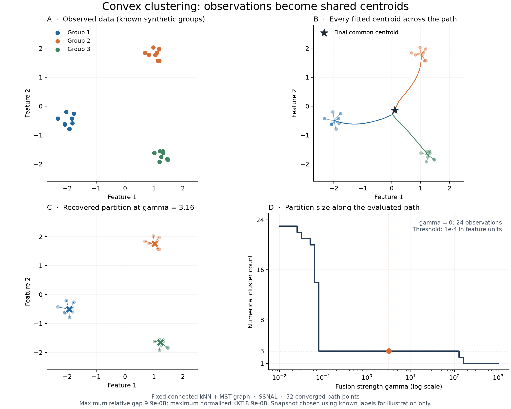

# A scientific workflow for convex clustering

Convex clustering fits one centroid per observation and penalizes differences
between centroids joined by a graph. A cluster emerges when several fitted
centroids coincide. The number of clusters is an outcome of the fusion
strength, graph, data geometry, and numerical labeling threshold.

This guide starts with complete observations and then explains paths,
certificates, model extensions, and entry holdout validation. The
[API reference](api.md) lists public functions and the
[compatibility audit](api_compatibility.md) documents estimator checks and their
scientific boundaries. The [algorithm audit](algorithm_audit.md) derives the corrected SSNAL method.

## 1. Define the observations and their geometry

Arrays use `(n_samples, n_features)`. The complete-data objective is

$$
\min_U \frac12\sum_i m_i\|U_i-X_i\|_2^2
       +\gamma\sum_{i<j}w_{ij}\|U_i-U_j\|_q.
$$

The default fidelity masses are `m_i = 1`. A graph edge has nonnegative
weight `w_ij`; a zero weight omits the edge. `gamma` balances fidelity and
fusion. This objective sums the fidelity over observations; it does **not**
divide by the sample count.

Before fitting, decide what distance between observations should mean. A
feature measured in thousands can dominate another measured in fractions.
Scaling all columns to unit variance gives them comparable marginal scales,
but it also changes the scientific model. Keep physical units when differences
in those units are meaningful, or apply a justified feature transformation.
The estimator does not standardize observations internally.

This small example deliberately uses commensurate features:

```python
import numpy as np
from ssnalclust import ConvexClustering

X = np.array([[0.0, 0.0], [0.1, 0.2], [4.0, 4.0], [4.2, 4.1]])
model = ConvexClustering(gamma=0.5, n_neighbors=1, tol=1e-7).fit(X)
assert model.converged_, model.result_.message
print(model.labels_)
print(model.centers_)          # One fitted centroid per observation
print(model.cluster_centers_)  # Averages within numerical label groups
```

`fit`, `fit_predict`, cloning, parameter inspection, and pipelines follow
scikit-learn conventions. This is a **transductive** fit: observations jointly
define the optimization problem. There is no out-of-sample `predict` method.
Adding observations and refitting can change existing centroids.

## 2. Choose a graph, then choose gamma

An edge expresses which centroid differences should be penalized. Graph
construction is part of the statistical model, not just an implementation
optimization. Removing edges changes the objective relative to a complete
graph.

| Builder | Weight on a retained edge | Appropriate interpretation |
| --- | --- | --- |
| `k_neighbors_graph` | `exp(-d² / (2 * bandwidth²))` | A symmetric union of directed local neighborhoods |
| `connected_k_neighbors_graph` | Same Gaussian formula | Local neighborhoods with an exact Euclidean MST added to connect them |
| `minimum_spanning_tree_graph` | Same Gaussian formula | A connected graph containing only the MST edges |
| `self_tuning_graph` | `exp(-d² / (s_i * s_j))` | Local distance scales instead of one global bandwidth |
| An explicit adjacency | Your nonnegative weights | Domain relationships, networks, or another stated graph model |

`ConvexClustering(weights=None)` builds kNN weights. In contrast,
`solve(weights=None)` and `convex_clustering_path(weights=None)` use a complete
unit-weight graph. Pass the same explicit adjacency to compare these APIs.
The graph is symmetric with zero diagonal; only one penalty is charged per
undirected edge. Sparse CSR input avoids allocating a dense adjacency.

Nearest-neighbor graph construction retains roughly `n_samples * n_neighbors`
edges and avoids a dense pairwise distance matrix. Exact MST builders currently
use quadratic distance storage. A small Gaussian bandwidth can make some
weights underflow to zero; ordinary kNN then omits those edges. Connected
builders raise an error if a required MST weight vanishes, instead of returning
a graph described as connected.

The self-tuning scale is the requested nonself-neighbor distance. For duplicate
observations with zero local scale, the builder uses the nearest distinct
observation; if all observations are identical, every retained weight is one.
Self-tuning weights remain unchanged when all features are multiplied by a
common positive constant, apart from floating-point effects and distance ties.

### Scaling changes the meaning of gamma

With dimensionless masses and weights, gamma has the same units as the
observations. For a **fixed** graph:

- If `X` is multiplied by `c > 0`, multiplying gamma by `c` multiplies the
  fitted centroids by `c`. For Gaussian graph construction, also multiply
  bandwidth by `c` to retain the original graph weights.
- If every graph weight is multiplied by `c`, divide gamma by `c` to retain
  the same optimization problem.
- If every fidelity mass is multiplied by `c`, multiply gamma by `c` to
  retain the same optimum.

These transformations do not extend to independently rescaling individual
features with a single correction to gamma. Such scaling changes the geometry.
Likewise, a gamma chosen for one graph density or sample count need not transfer
to another: a complete graph has quadratically many potential fusion terms.

`penalty="l2"` treats feature directions rotationally symmetrically. `l1`
penalizes coordinate differences separately and `linf` penalizes the largest
coordinate difference on an edge. The latter two depend on the chosen feature
axes. SSNAL currently supports `l2`; ADMM, AMA, and FAMA support all three norms.

### Disconnected graphs and fidelity masses

With a disconnected graph, the objective separates over connected components.
No fusion penalty couples different components, whatever gamma is. An isolated
observation remains at its observed value under complete squared loss. At
sufficient fusion strength, a fully fused component has its fidelity-weighted
mean as its common centroid. The numerical labeler can nevertheless assign
coincident centroids from different graph components the same label, because
it inspects centroid positions rather than graph membership.

Strictly positive `sample_weight` values weight the fidelity term on the fixed
graph. They are useful for unequal observation precision or a deliberately
weighted objective. They are not an instruction to duplicate observations:
duplication changes both the graph and its fusion terms. Zero fidelity masses
are unsupported in the complete-data solver; use an explicitly defined
missing-data model for omitted entry losses.

## 3. Follow a regularization path and inspect recovery

Build the graph once and reuse it at every strength. Recomputing weights from
the fitted centroids produces a different sequence of objectives.

```python
from ssnalclust import (
    connected_k_neighbors_graph, convex_clustering_path, summarize_path,
)

W = connected_k_neighbors_graph(X, n_neighbors=2, bandwidth=2.0)
gammas = [0.0, 0.1, 0.5, 2.0, 10.0]
path = convex_clustering_path(X, gammas, weights=W, tol=1e-7, max_iter=500)
assert all(point.converged for point in path)
summary = summarize_path(path, cluster_tol=1e-4)
for gamma, point in zip(gammas, summary):
    print(gamma, point["n_clusters"], point["kkt_residual"], point["splits"])
```

A path reuses the previous primal and edge dual iterates as warm starts. Each
point still has to satisfy its own stopping criteria. Strengths are evaluated
in the order provided and need not increase. The returned finite grid is a
sample of a solution path, not a calculation of every exact fusion time.

Arbitrary weighted convex clustering paths need not form a hierarchy: clusters
can split along a path. `summarize_path` reports numerical merges and splits
between consecutive partitions and does not impose irreversible fusion or
construct an assumed dendrogram. In particular, a monotone-looking example is
not a guarantee for other data or weights.



Reproduce this figure with:

```bash
python -m pip install -e '.[examples]'
python examples/plot_clustering_paths.py --output artifacts/clustering_paths.png
```

Omit `--output` to display it interactively; use a `.pdf` output filename for a
vector figure. The example has a fixed seed, checks every path point for
convergence, and displays the largest achieved relative gap and KKT residual.
It uses known synthetic labels to choose a readable recovery snapshot. That
choice demonstrates behavior; it is not a model-selection procedure for
unlabeled observations.

### Reuse a prepared problem or stream a long path

`ConvexClusteringProblem` copies the data, graph, and fidelity masses once.
Repeated solves reuse graph preparation; ADMM also reuses a sparse
factorization while its `sigma` remains unchanged. The cache retains only the
most recent factorization. Separate calls to `problem.solve` start cold unless
warm starts are supplied; `problem.path` and `problem.iter_path` manage warm
starts automatically.

```python
from ssnalclust import ConvexClusteringProblem

problem = ConvexClusteringProblem(X, weights=W)
for gamma, result in zip(gammas, problem.iter_path(
        gammas, solver="admm", tol=1e-7, max_iter=20000, store_history=False)):
    assert result.converged, result.message
    print(gamma, result.objective, result.relative_gap)
```

Streaming with `store_history=False` avoids retaining every result and its
iteration history; consume results immediately rather than accumulating them
in a list. Final diagnostics remain available, and `history` is empty. The
convenience `iter_convex_clustering_path` constructs a prepared problem and
yields the same kind of results. A prepared instance owns mutable caches;
create separate instances for concurrent solves. Inputs and returned arrays
are copied so caller mutations do not change the prepared problem or a later
path point's warm start.

### Numerical clusters are a separate interpretation step

The optimized `centers_` are continuous floating-point values. Labels connect
**all** pairs of centroids at Euclidean distance at most `cluster_tol`, then
take connected components. The threshold uses the coordinate units in which
the model was fitted. It is not a penalty parameter and does not affect the
optimization solution.

The relation is transitive: at threshold 0.1, centroids at 0.00, 0.09, and 0.18
receive one label even though the first and last are 0.18 apart. Consequently,
`cluster_tol` does not bound a labeled cluster's diameter. A threshold that is
too large can join centroids that are still statistically distinct; a threshold
that is too small can turn floating-point differences within a fused group
into several labels. Near a fusion event, check sensitivity to both optimizer
tolerance and labeling threshold, and report both in scientific work.

## 4. Establish accuracy before comparing solvers

All complete-data solvers minimize the same chosen objective, but iteration
counts have different meanings. An SSNAL outer iteration includes an inner
Newton solve; an ADMM iteration includes a linear solve; AMA/FAMA iterations
use first-order operations. Comparing equal iteration counts does not compare
equal accuracy or equal work.

For complete squared loss, inspect both:

- `relative_gap = gap / (1 + abs(objective) + abs(dual_objective))`;
- the normalized `kkt_residual`, which tests stationarity and the edge
  subgradient condition.

A result is marked converged only when both are at most `tol`. The gap compares
the true primal objective of the returned centroids with a feasible edge dual.
It does not substitute the objective of an unconverged split variable.

Here is an accuracy-gated timing comparison, using the same data and graph:

```python
from time import perf_counter
from ssnalclust import solve

for method in ["ssnal", "admm", "ama", "fama"]:
    start = perf_counter()
    result = solve(X, weights=W, gamma=0.2, solver=method,
                   tol=1e-7, max_iter=20000)
    seconds = perf_counter() - start
    assert result.converged, (method, result.message)
    print(method, seconds, result.relative_gap, result.kkt_residual)
```

The tolerance defines the same acceptance target; methods may finish at
slightly different accuracies below it. Include achieved diagnostics alongside
time. Repeat timings for performance claims and record hardware, versions,
thread settings, graph size, and whether graph construction and factorization
are included. The [benchmark example](../examples/benchmark.py) provides a
starting point. A single small example does not establish a fastest method
for larger data.

Positive complete-data fidelity masses make the centroid objective strongly
convex and its minimizer unique. In exact arithmetic, a valid primal-dual gap
`g` implies a centroid error bound `sqrt(2*g/min(sample_weight))` in Frobenius
norm. Floating-point certificates are numerical diagnostics, not interval
arithmetic proofs. Edge duals can be nonunique even when centroids are unique.

### Exact model, approximate arithmetic

The algorithms solve the stated convex objectives to finite tolerances. No
finite tolerance turns numerical equality into a proof of an exact fusion
event. Graph sparsification changes the model; it is distinct from stopping an
optimizer early on the same model. Paths evaluate a finite strength grid, and
label thresholds add a further numerical interpretation layer.

`max_iter` exhaustion returns `converged=False`; estimators also emit a
`ConvergenceWarning`. Inspect `message`, `history`, and achieved diagnostics.
Increasing the iteration budget may help. Very large coordinate offsets can
make tight accuracy unrepresentable in the returned floating-point values;
center or rescale observations in that case. Changing tolerance changes the
accuracy target, not the underlying objective.

## 5. Choose a fidelity and structure that match the observations

The alternative solvers use PDHG and report true KKT residuals for their own
objectives. Feature-sparse clustering and biclustering also report feasible
primal-dual gaps derived for their stacked penalties, and require both gap
and KKT tolerances. Generalized fidelities use feasible loss-specific conjugate
certificates. Missing-data fitting derives a lower bound from an equivalent
observed-range box problem: within each component and feature, clipping to the
observed range cannot increase the original objective. It also checks the
original masked model's KKT conditions. All these models require both their
relative gap and KKT residual to satisfy tolerance. These are model-specific
certificates, not substitutions of the complete-data quadratic dual. The
[model definitions](models.md) give full formulas.

| Data or purpose | Entry point | Interpretation of returned centroids |
| --- | --- | --- |
| Partially observed matrix | `solve_missing` / `MissingConvexClustering` | Values fitted using only the observed-entry fidelity |
| Outlier-resistant real observations | `solve_generalized(loss="huber")` | Locations in the original feature units |
| Binary observations or Bernoulli proportions | `solve_generalized(loss="logistic")` | Log-odds; use `fitted_means` for probabilities |
| Nonnegative count observations | `solve_generalized(loss="poisson")` | Log-means; use `fitted_means` for expected counts |
| Feature-group sparsity | `solve_sparse` / `SparseConvexClustering` | Column-centered fitted values; add `offset` to restore locations |
| Row and column fusion | `solve_biclustering` / `ConvexBiclustering` | A jointly fitted matrix in input coordinates |

Huber's `huber_delta` is in residual units: below it the loss is quadratic;
beyond it the loss grows linearly. Feature units therefore affect robustness
as well as graph distances. Huber and missing-data solutions need not be
unique; KKT residuals do not automatically bound centroid error for those
models.

Logistic and Poisson fusion applies to **natural parameters**, not to
probabilities or expected counts. Equal distances in log-odds or log-means do
not imply equal distances after the inverse link. The generalized estimator's
`cluster_tol` is also in natural-parameter coordinates. Do not standardize
binary/count values into arbitrary real numbers and then fit the corresponding
likelihood. The current Poisson API has no exposure-offset argument; unequal
exposures require a model that represents that information explicitly.

Some likelihood configurations have an unattained infimum rather than a
finite optimum. Within every positive-fusion graph component, each logistic
feature must contain both some positive success mass and some positive failure
mass; each Poisson feature must have a positive total count. Boundary-only
components are rejected, including individual boundary observations at gamma
zero. This avoids quietly clipping natural parameters into a different model.

For sparse clustering, centering is part of the stated objective; automatic
unit-variance scaling is not. An entire centered fitted column can vanish,
indicating removal of that feature's variation. Restoring `offset` may yield
a nonzero constant column, which is consistent with its variation being
removed. Biclustering uses separate sample and feature graphs and separate
fusion strengths; it does not alternate between independently fitted row and
column clustering problems.

Runnable examples are available for [missing entries](../examples/missing_usage.py),
[robust and likelihood models](../examples/generalized_usage.py), and
[sparsity and biclustering](../examples/structured_usage.py).

## 6. Validate gamma without leaking held-out entries

`select_gamma` provides one entry-holdout split for a masked quadratic model.
It holds out some finite entries, reserves at least one training observation
per connected component and feature, fits every positive candidate gamma on
the same training mask, scores held-out MSE, and refits the selected strength
using every originally observed entry.

The graph must be supplied explicitly. For validation, an exogenous graph
(such as known sequence adjacency) is often convenient. A graph computed from
the full feature matrix can encode the validation targets and leak information,
even though those targets are absent from the fitted fidelity. Similarly,
centering or scaling based on held-out values can leak them. The selector
neither constructs a graph nor preprocesses values internally; the caller
must establish their provenance.

```python
import numpy as np
from scipy import sparse
from ssnalclust import select_gamma

X_sequence = np.array([[0.0, 0.1], [0.2, np.nan], [0.1, 0.3],
                       [2.0, 1.8], [2.2, 2.0], [2.1, 1.9]])
W_sequence = sparse.diags([np.ones(5), np.ones(5)], [-1, 1], format="csr")
selection = select_gamma(X_sequence, [0.1, 0.3, 1.0], W_sequence,
                         random_state=42, tol=1e-6, max_iter=20000)
print(selection.best_gamma, selection.validation_errors)
refitted_centroids = selection.best_result.centers
```

Candidate fits receive erased validation values as well as an explicit training
mask. Every candidate and the final refit must converge; failed optimization
raises an error rather than entering the score comparison. Gamma zero is
excluded because a held-out coordinate has no identifiable estimate without
fusion. Some data allow no identifiable holdout split at all, which also raises
an error.

This validation estimates reconstruction of missing entries for the chosen
transductive graph model. It does not estimate prediction on new samples,
guarantee cluster recovery, or provide an unbiased final performance estimate
after selecting gamma. Use additional validation splits or an external test
set when the scientific question requires them, with graph and preprocessing
construction restricted appropriately in each split. The returned masks make
the actual held-out entries inspectable.

The masked objective can have multiple optimal missing-value predictions.
Scores evaluate the solver's deterministic initialization and observed-range
box convention; a small objective gap does not bound missing-entry prediction
error. Nonfinite predictions and unrepresentable MSEs raise before selection
or refitting. Finite MSE calculation avoids intermediate sum-of-squares
overflow when the mean itself remains representable. The executed
[Wine study](wine_holdout.md) shows why this distinction matters: its
training-only entry-holdout choice improves reconstruction tuning MSE but
leaves all full-data observations in singleton clusters.

The [moons and circles recovery study](recovery_study.md) separates numerical
convergence from recovery, reports every fixed-grid point, and documents
centroid-label sensitivity on concentric components. Its best-over-grid
scores use ground truth and are explicitly oracle diagnostics.

## Reporting a reproducible analysis

Record the data transformation, graph construction and parameters, edge norm,
fidelity, fidelity masses if used, selected gamma and its selection procedure,
solver and iteration budget, achieved certificates, and numerical labeling
threshold. For a path, retain its strength grid and note any nonconverged points
or threshold-sensitive transitions. Record package versions and random seeds.
Cite the underlying methods described in the [references](../CITATION.cff),
in addition to identifying the software version used.
