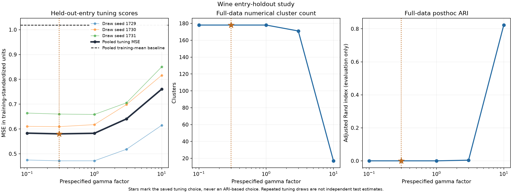

# Wine: reconstruction tuning can select singleton clusters

The fixed held-out-entry rule selected factor 0.3 on the Wine data, with a
pooled reconstruction tuning MSE of 0.580442 versus 1.018663 for the training
feature-mean baseline. Its full-data fit nevertheless contains 178 singleton
clusters and has posthoc cultivar ARI zero. All 15 masked candidate fits and
five full-data fits converged, and an independent artifact audit passed all
399 checks.

This is a reproducible example of the distinction between entry reconstruction
and partition recovery. It improves the library's validation workflow and
numerical safeguards without establishing a reliable default for selecting
cultivar groups. The result is retained alongside the earlier
[Digits silhouette-selection failure](digits_study.md).

## Observed result



| Factor | Pooled standardized tuning MSE | Full-data gamma | Full-data groups | Posthoc ARI |
| ---: | ---: | ---: | ---: | ---: |
| 0.1 | 0.583329 | 0.024447 | 178 | 0 |
| **0.3, selected** | **0.580442** | **0.073340** | **178** | **0** |
| 1 | 0.582716 | 0.244467 | 178 | 0 |
| 3 | 0.640802 | 0.733402 | 171 | 0.003975 |
| 10 | 0.760435 | 2.444675 | 17 | 0.822631 |

The selected tuning score is 43.0% below the pooled training-mean baseline
on these particular withheld entries. This comparison uses the same draws
that selected the factor; it is not an unbiased final prediction-performance
estimate. Factors 0.1, 0.3 and 1 are nearly tied: factor 1's pooled score is
only 0.002274 above the selected score. The three draw-specific winners are
0.3, 0.3 and 1. No confidence interval or selection-consistency claim follows
from these three overlapping tuning draws.

Factor 10 gives greater agreement with cultivar labels, but it was not
selected. We did not replace the saved choice, extend the grid, or force
three groups. A lower reconstruction score does not imply recovery of the
cultivar partition, and the numerical convergence flag does not certify
that scientific interpretation.

## What was fixed before fitting

The [protocol](heldout_protocol.md) and original source files were committed
at `406d231`. The fitting implementation was committed at `916aebd`, after
unit tests and a separate 24-row smoke workflow, before the full-data runs.

The data are 178 wines with 13 chemical features from
[UCI Wine](https://archive.ics.uci.edu/dataset/109/wine), attributed to
Aeberhard and Forina (1992), DOI 10.24432/C5PC7J. The first-column cultivar
label is excluded by the feature loader and loaded for evaluation only after
selection and full-data fitting. Original data, metadata, licensing and hashes
are included [offline](path:../examples/data/README.md).

Seeds 1729, 1730 and 1731 each hold out 17 entries per feature, leaving 161
training entries per feature. The 221 withheld entries per draw can overlap
across draws; there are 663 scored entry occurrences per candidate factor.
Masks depend on matrix shape and seed, not feature values or labels.

Before any statistic or distance calculation, withheld values are physically
erased. Each draw uses its training feature means and population standard
deviations. Missing standardized entries become zero only for graph distances;
they remain missing in the fitted fidelity. A symmetric union 10-neighbor
graph uses stable row-index ties and a Gaussian weight with bandwidth equal
to the median positive retained-edge distance. All four realized graphs
(three training draws plus full data) are connected and have no unanchored
features. No graph repair or imputed fidelity observations were added.

Within a draw, every candidate shares its preprocessing and graph. Its gamma
is `factor * training_bandwidth / 10`. Selection therefore compares the
prespecified factors; absolute gammas differ slightly across draws. Held-out
MSE is evaluated in training-standardized feature units, using
`(raw_target - training_mean) / training_scale`. The training-feature-mean
baseline predicts zero in those same units. This avoids allowing Wine's
largest-unit chemical measurements to dominate an original-unit pooled MSE.

After factor selection, full-data scaling and the graph are recomputed using
all feature entries. Full-data gamma uses that graph's bandwidth, 2.44467467.
All five full-data strengths are retained. Cluster labels use transitive
centroid-distance components at tolerance 1e-4. No out-of-sample prediction
or classifier accuracy is estimated.

## Numerical checks and imputation limits

The masked candidates use the existing cold-start PDHG solver with its
observed-range-box convention, tolerance 1e-6 and a 30,000-iteration limit.
The full path uses warm-started SSNAL, tolerance 1e-6 and at most 300 outer
iterations. All prescribed fits meet both their relative-gap and original
KKT stopping criteria. The independent audit's largest KKT residual is
9.999505e-7 and largest relative gap is 1.878099e-7.

Saved masks, training arrays, statistics, graph CSR arrays, centroids and
**edge duals** support an [independent audit](wine_holdout/audit.json). It
reconstructs the training-only graphs and scores, checks edge-dual feasibility,
evaluates masked primal and bounded-dual objectives through explicit scalar
minimizations, and recomputes the original KKT conditions. It also checks the
full-data quadratic dual, partitions, posthoc ARIs, pooled scores, and saved
selection. The largest observed dual-ball excess is 2.22e-16, within the
stated rounding allowance. These floating-point checks are not interval
arithmetic proofs or evidence of imputation uniqueness.

Missing-coordinate optima can be nonunique even when every graph component
has observed values for every feature. For example, on a three-node scalar
chain with training observations `[0, missing, 2]` and unit-edge gamma 0.1,
endpoints 0.1 and 1.9 and any middle value in `[0.1, 1.9]` attain objective
0.19. If the withheld target is 1, those equally optimal middle values give
different prediction errors. A certified objective gap cannot resolve that
ambiguity. The reported scores evaluate the existing solver's deterministic
initialization and bounded-solution convention.

Entry holdout follows the prediction idea in Chi, Allen and Baraniuk,
[*Convex Biclustering*, §5.1](https://arxiv.org/pdf/1408.0856v4). This study uses
one-way clustering and PDHG, without their COBRA procedure or a centroid
bias-correction step. It is an explicitly specified adaptation, not a
replication of their experiments or an application of their theory to a
new model without further justification.

## Library and workflow improvements

`select_gamma` continues to provide a single holdout split for an explicitly
supplied external graph. Its MSE calculation now rescales residuals before
squaring and averaging, so intermediate sums do not overflow when the mean
is representable. Nonfinite predictions, overflowing residuals and
unrepresentable MSEs raise before choosing a candidate or refitting; a bad
candidate is never silently dropped.

The Wine example orchestrates its own repeated masks because its preprocessing
and graph must be estimated separately within each draw. The
[training-only helper](path:../examples/heldout_preprocessing.py) is an example
component, not a new public estimator API. Regression tests replace hidden
values with NaN, infinity and large finite sentinels and verify unchanged
training statistics, graphs, fitted centers and certificates. Selection tests
reject incomplete draws, duplicate seeds, mismatched candidates, invalid
scores and nonconvergence while preserving deterministic tie handling.

## Timing and reproduction

| Worker | Process seconds | Observed peak RSS (MiB) | Fit count |
| --- | ---: | ---: | ---: |
| Draw 1729 | 14.99 | 148.38 | 5 |
| Draw 1730 | 10.14 | 146.22 | 5 |
| Draw 1731 | 18.58 | 152.83 | 5 |
| Full-data path | 2.11 | 149.86 | 5 |

These are single sequential fresh-process measurements on macOS 26.5.1 arm64,
Python 3.12.5, NumPy 2.5.2, SciPy 1.18.1 and scikit-learn 1.9.0. Each worker
requested six numerical thread variables at one and had a 900-second deadline.
Peak RSS includes imports and native allocations and is observed through the
final full checkpoint; it is not current memory. Process time includes imports,
preprocessing, fitting, diagnostics and artifact writes. The draw-to-draw
variation is not a repeated timing comparison for one identical problem.

From a checkout with plotting dependencies installed:

```bash
python -m pip install -e '.[examples]'
python examples/wine_holdout_study.py --output-dir build/wine-rerun
python examples/plot_wine_holdout.py build/wine-rerun/study.json --output build/wine-rerun.png
python examples/audit_wine_holdout.py build/wine-rerun --output build/wine-rerun/audit.json
```

Use a fresh output directory. Add `--smoke` to the first command for the
separate first-24-row, one-draw, two-factor workflow check. Its outcomes are
not full-study evidence. Every prescribed candidate/draw must converge and
have a finite score before selection; the selected full-data refit must also
converge. Partial checkpoints and failed statuses remain inspectable.

The [study manifest](wine_holdout/study.json) and
[frozen selection](wine_holdout/selection.json) link to hashes and execution
records. Complete worker artifacts are retained:

| Worker | Metadata | Arrays and edge duals | Log |
| --- | --- | --- | --- |
| Draw 1729 | [JSON](wine_holdout/holdout_1729.json) | [NPZ](wine_holdout/holdout_1729.npz) | [Text](wine_holdout/holdout_1729.txt) |
| Draw 1730 | [JSON](wine_holdout/holdout_1730.json) | [NPZ](wine_holdout/holdout_1730.npz) | [Text](wine_holdout/holdout_1730.txt) |
| Draw 1731 | [JSON](wine_holdout/holdout_1731.json) | [NPZ](wine_holdout/holdout_1731.npz) | [Text](wine_holdout/holdout_1731.txt) |
| Full data | [JSON](wine_holdout/full.json) | [NPZ](wine_holdout/full.npz) | [Text](wine_holdout/full.txt) |

The current local suite passes 753 tests, with 59 focused tests also passing
on minimum dependencies. Additional work remains on partition-specific
selection methods, imputation-convention sensitivity, separate evaluation
masks, broader datasets, and statistical uncertainty.
